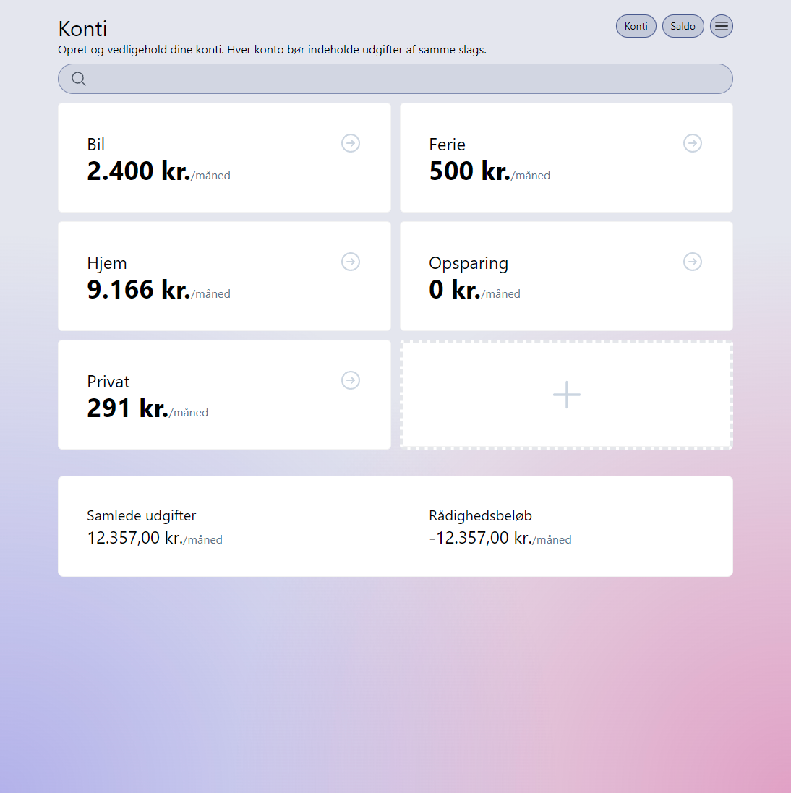

## Svelte budget planner

Simple budget planning application, built using SvelteKit.



### Tech stack

- SvelteKit
- Auth.js (OAuth 2.0)
- Drizzle (PostgreSQL)
- Skeleton UI
- TypeScript
- Tailwind CSS
- Playwright (End-to-end tests)
- Vitest (Unit tests)

### What can it do?

The budget planner allows you to manage your expenses in a simple user interface. The application keeps track of payment
dates, which it uses to calculate the required account balances, to avoid overdrawing.

### Try it out 🚀

I'm hosting the app [here on Vercel](https://svelte-budget-planner.vercel.app/). You can sign in using your GitHub
account or as a demo user.

### Installation

If you want to run it yourself you can follow these instructions.

I use the Vercel CLI to link the application with my project in Vercel ([Read more](https://vercel.com/docs/cli)).

```bash
npx vercel link
```

After linking the project, create an `.env` file by running:

```bash
npx vercel env pull .env
```

### Environment variables

The following environment variables are need.

#### Auth.js

The app is only set up to work with GitHub so these variables are required.

```
AUTH_GITHUB_ID=
AUTH_GITHUB_SECRET=
AUTH_SECRET=
```

#### Playwright

Playwright needs to know which site to navigate to, when testing.

```
PLAYWRIGHT_BASE_URL=https://svelte-budget-planner.vercel.app
```

#### PostgreSQL

The Neon PostgreSQL database connection requires:

```
DATABASE_URL=
```
