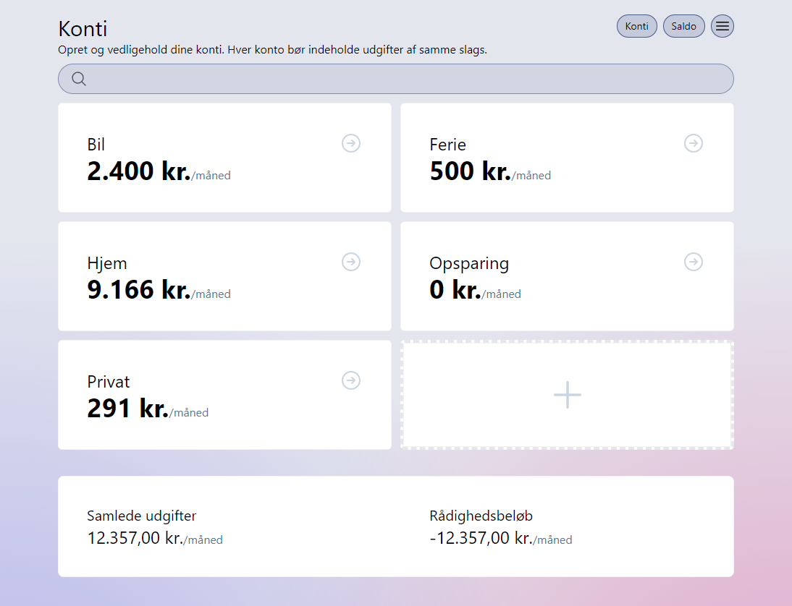

## Svelte budget planner

Simple budget planning application, built using SvelteKit.



### Tech stack

- SvelteKit
- Auth.js (OAuth 2.0)
- TypeScript
- PostgreSQL
- Skeleton UI
- Tailwind CSS
- Playwright (End to end tests)
- Vitest (Unit tests)

### What can it do?

The budget planner allows you to manage your expenses in a simple user interface. The application keeps track of payment dates, which it uses to calculate the required account balances, to avoid overdrawing.

### Try it out 🚀

I'm hosting the app [here on Vercel](https://svelte-budget-planner.vercel.app/). You can sign in using your GitHub account or as a demo user.

### Installation

If you want to run it yourself you can follow these instructions.

To link the application with your Vercel PostgreSQL database, run the following commands:
[Read more](https://vercel.com/docs/cli)

```bash
npx vercel link
npx vercel env pull .env
```

Auth.js requires three environment variables:

```
AUTH_GITHUB_ID=
AUTH_GITHUB_SECRET=
AUTH_SECRET=
```

Playwright requires:

```
PLAYWRIGHT_BASE_URL=https://svelte-budget-planner.vercel.app
```
